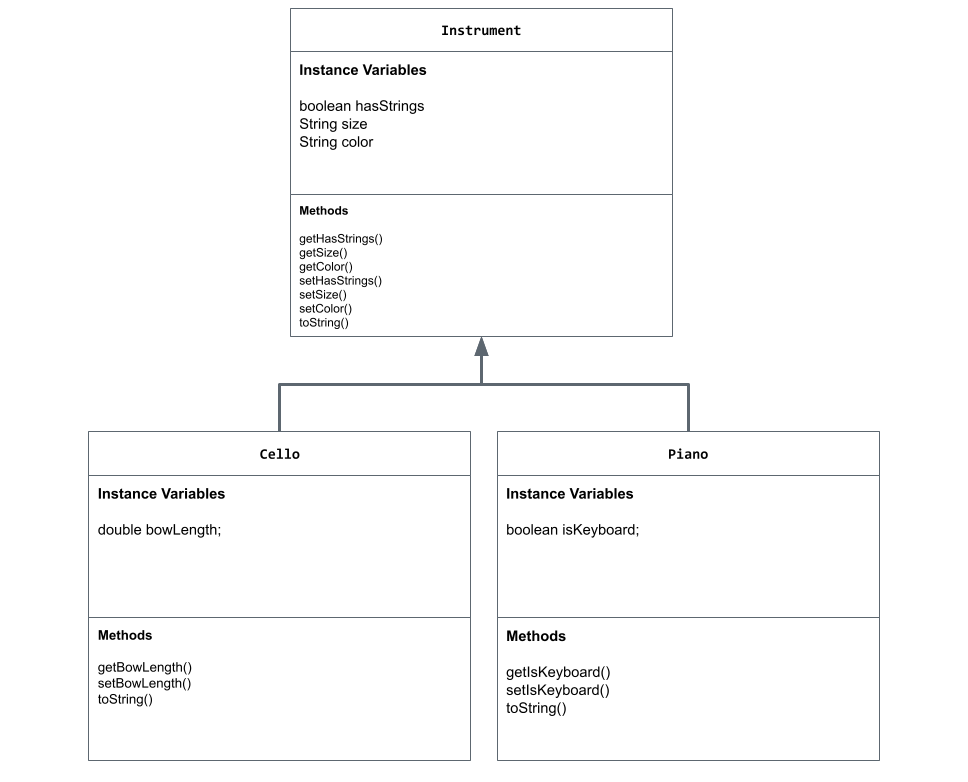

# Unit 2 - Store Management Project

## Introduction

You are opening a new business in your community! Businesses often need programs to manage the products and services they offer and track orders and requests from customers. Your goal is to create a store management system for your business.

## Requirements

Use your knowledge of object-oriented programming and class structure and design to create your store management system:
- **Create a class hierarchy** – Develop a superclass that represents a product or service your business offers and one or more subclasses that extend the superclass to represent more specific types of products or services.
- **Declare instance variables** – Declare instance variables in the superclass that are shared with the subclasses and instance variables in the subclasses that are not shared with the superclass.
- **Write constructors** – Write no-argument and parameterized constructors in the superclass and subclasses. Subclass constructors use the super keyword to call the superclass constructor.
- **Implement accessor and mutator methods** – Write accessor and mutator methods for instance variables that should be accessible and/or modifiable from outside of the class.
- **Implement a toString() method** – Write toString() methods in the superclass and subclasses that return information about the state of an object.

## UML Diagram

## Description

For my project, I created an instrument/music store management system. I chose this topic because I play the cello, and I thought it would be interesting to combine computer science and this hobby. I created instance variables for the size and color of the instruments, as well as whether or not the instrument has strings. These all have private access modifiers. I also refactored these instance variables in the Cello and Piano subclasses. In each class, I included a no-argument constructor with default values for the variables and a parameterized constructor, where variables are also initialized. Additionally, I wrote accessor methods, mutator methods, and overrides for the toString() method in each class. Lastly, I implemented the Scanner class to collect user input and create an object. The program first asks the user which instrument they would like to purchase, and depending on the response, it displays more questions that ask for the values of the instance variables. The responses to these questions must have the correct data types (String, int, double, etc). All in all, this program allows the user to create a customized Instrument object or a Piano/Cello object that has attributes specific to the instrument. It also displays the attributes of the object.